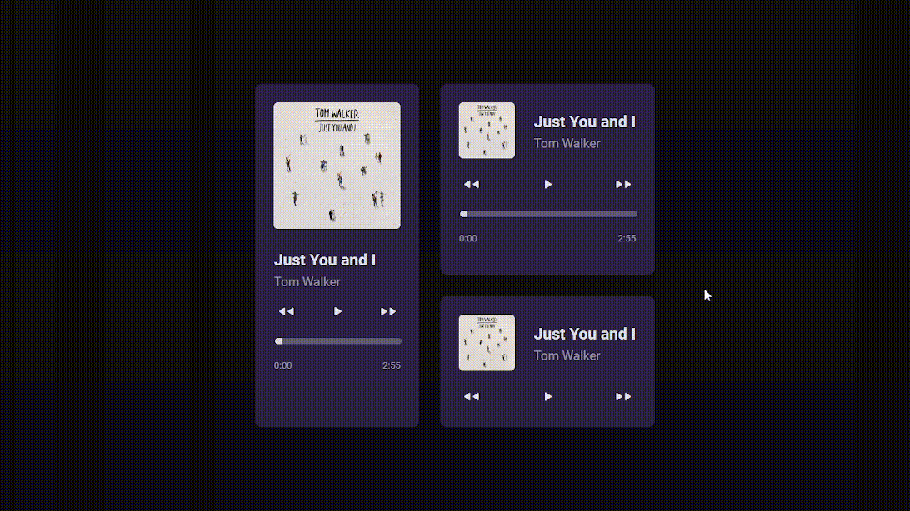

# Music Player Website with React and Typescript



Welcome to my music player website made with React and Typescript! This repository is intended to be a learning experience to improve my knowledge in React and Typescript. This music player website provides the ability to play my favorite songs.

## 💻 Technologies used

This music player website is built with the following technologies:

[](https://www.typescriptlang.org/)
[](https://reactjs.org/)
[](https://vitejs.dev/)
[](https://code.visualstudio.com/)


##  🚀 Deploy

You can access the music player by clicking the following button:

[](https://diozenio.github.io/music-player/)

## 🔧 Installation

To install this music player website, you need to have Node.js and npm installed.

Clone this repository to your local machine:
```
git clone https://github.com/diozenio/music-player
```

Install the dependencies:
```
npm install
```

Start the development server:
```
npm run dev
```

Open `http://localhost:5173/music-player` in your browser to view the website.

## 🤝 Contributing

If you would like to contribute to this music player website, please feel free to submit a pull request with your changes.

## 🔖 License

This project is licensed under the MIT License.